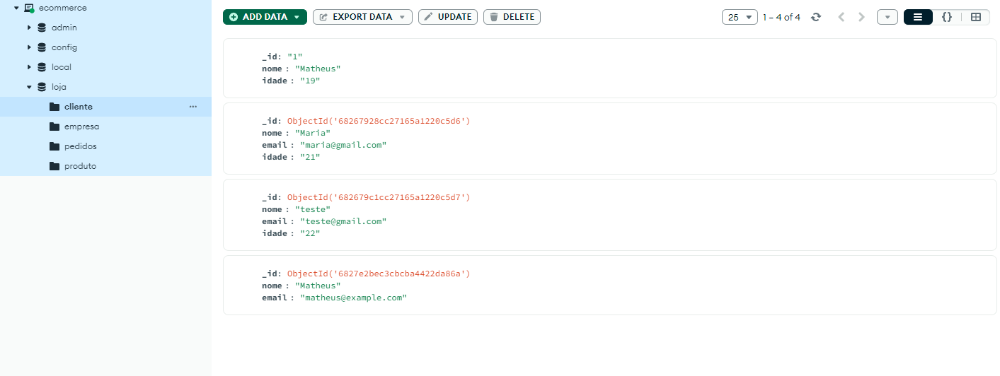
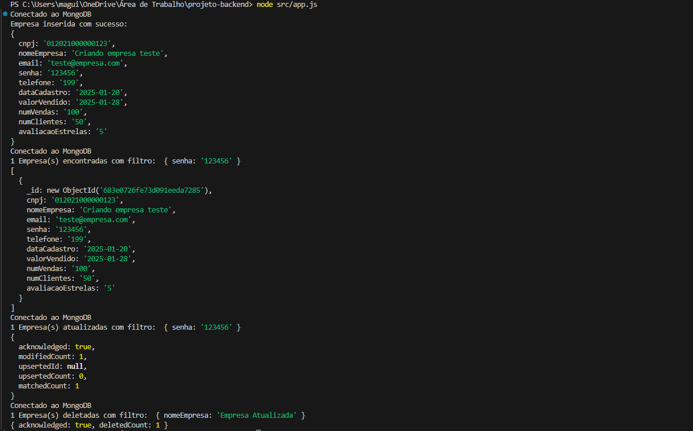

# 🛒 Projeto Back-end de E-commerce

> Este é um projeto para um sistema de e-commerce, construído com foco em aprendizado e boas práticas em Node.js e MongoDB. Ele implementa as operações básicas de um CRUD (Create, Read, Update, Delete) para: `empresa`, `cliente`, `produto` e `pedido`.

O sistema será escalado futuramente, já estou separando responsabilidades em `models` (dados e validações) e `controllers` (regras de negócio), com estrutura pronta para ***futura integração com o Express***.

## 🚀 Como rodar o projeto

1. **Clone o repositório:**

   ```bash
   git clone https://github.com/MatheusMadureiraa/projeto-backend.git
   ```

2. Instale as dependências:

    ```bash
    npm install
    ```

3. Configure o MongoDB:
Certifique-se de que o MongoDB esteja rodando localmente na porta padrão 27017 ou ajuste a porta no arquivo `database.js`.

Execute o projeto:

    ```bash
    node src/app.js OU node app.js -> se vc estiver dentro da pasta src/
    ```

O arquivo app.js chama os métodos dos controllers para testar as operações de CRUD de cada rota.

## 🧰 Stacks utilizadas e estrutura
- Node.js
- MongoDB
- JavaScript
- Arquitetura MVC simplificada
- Log de erros em arquivo (fs)
- Estrutura pronta para uso com Express

## 📌 MongoDB e Terminal após CRUD
<div align="center">
     
    <br /> 
     
</div>

Feito com ❤️ por **Matheus Madureira**

